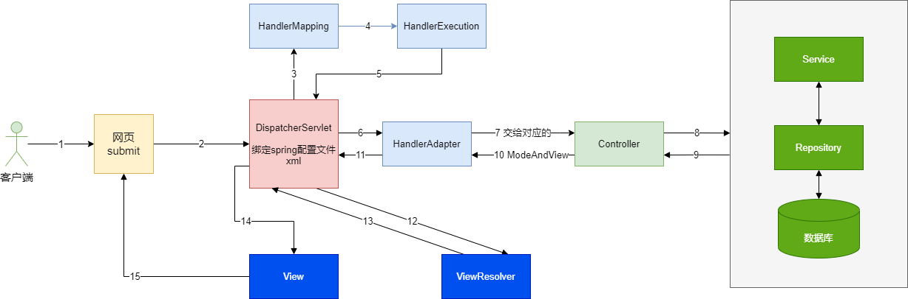

# 运行流程

在springMVC中所有请求都会委托给DispatcherServlet进行处理，它需要完成以下任务。



1）、客户端点击链接会发送 http://localhost:8080/hello 请求
2）、来到tomcat服务器；
3）、SpringMVC的前端控制器收到所有请求；
4）、来看请求地址和@RequestMapping标注的哪个匹配，来找到到底使用那个类的哪个方法来处理
5）、前端控制器找到了目标处理器类和目标方法，直接利用返回执行目标方法；
6）、方法执行完成以后会有一个返回值；SpringMVC认为这个返回值就是要去的页面地址
7）、拿到方法返回值以后；用视图解析器进行拼串得到完整的页面地址；
8）、拿到页面地址，前端控制器帮我们转发到页面；

**细节：／和／＊**

在web.xml下配置DispatchServlet的拦截url=/的时候，事实上原理是：

- 所有web.xml都继承自tomcat中的web.xml
- tomcat中已经使用/对静态资源进行拦截，而当配置DispatchServlet的拦截url=/，则表示覆盖tomcat拦截
- DispatchServlet拦截到请求之后，会在DispatchServlet找@RequestMapping标注匹配的controller进行处理

# 注解

## `@RequestMapping`

RequestMapping提供了很多有用的参数

- `method`，限定请求的方式【GET】, HEAD, 【POST】, PUT, PATCH, DELETE, OPTIONS, TRACE
- `params`，规定请求的参数匹配params={"username!=123","pwd","!age"}
- `headers`，请求头，实现“只让chrome访问”的需求`User-Agent: Mozilla/5.0 (Windows NT 10.0; Win64; x64) AppleWebKit/537.36 (KHTML, like Gecko) Chrome/89.0.4389.114 Safari/537.36 Edg/89.0.774.68`
- `consume`：只接受内容类型是哪种的请求，规定请求头中的Content-Type
- `produces`：告诉浏览器返回的内容类型是什么，给响应头中加上Content-Type:text/html;charset=utf-8

RequestMapping支持通配符路径匹配

````
@RequestMapping("/antTest0?")
@RequestMapping("/antTest0*")
@RequestMapping("/a/*/antTest01")
@RequestMapping("/a/**/antTest01")
````

## 参数传入数据

**REF**

参数可以查手册

 https://docs.spring.io/spring-framework/docs/current/reference/html/web.html#mvc-ann-arguments

或查笔记 SpringMVC_请求数据传入

`@PathVariable`路径参数

`@RequestParam`?后的参数

`@RequestHeader`绑定请求报头的属性值

`@CookieValue`用 @CookieValue 绑定请求中的 Cookie 值

`POJO作为参数`，SpringMVC提供了自动封装对象的能力，需要Input中的name属性和变量名一致，并且支持级联疯转。

`原生API作为参数`，springMVC支持使用 原生API作为参数，例如HttpServletRequest，HttpServletResponse

## 传出数据

提供了以下几种途径输出模型数据：

- ModelAndView: 处理方法返回值类型为 ModelAndView 时, 方法体即可通过该对象添加模型数据 
- Map 及 Model: 入参为 org.springframework.ui.Model、org.springframework.ui.ModelMap 或 java.uti.Map 时，处理方法返回时，Map 中的数据会自动添加到模型中。
- @SessionAttributes: 将模型中的某个属性暂存到 HttpSession 中，以便多个请求之间可以共享这个属性
- @ModelAttribute: 方法入参标注该注解后, 入参的对象就会放到数据模型中

# Restful 风格

 [RestTestController.java](..\springMVC-06-Rest\src\main\java\com\springmvc\rest\RestTestController.java) 

Rest的作者认为，网络请求无非是操作资源，于是对于资源的种种操作，使用Rest风格的约定写法会变得非常简洁。来看一个例子。

在没有rest之前

````java
/getBook?id=1 查询
/deleteBook?id=1 删除
/updateBook?id=1 更新
/addBook?id=1 增加
````

看到上面增删查改都是操作书，只能通过url名来标志动作，但是http明明提供了各种方法。来看Rest推荐版本。

````java
/book/1 查询，方法为get
/book/1 增加，方法为post
/book/1 更新，方法为put
/book/1 删除，方法为delete
````

是不是非常简洁。

## 定义

在Rest看来，一切都是资源。所以再来看Rest的定义。

Representational State Transfer，资源表示状态转化，就比如说删除一本书，那么这个操作最终就会导致数据库中的资源状态转化。

## 设计理念

再来看设计理念。

这是一种架构的风格。
以Web为例，Restful希望：我们使用资源来定位，使用HTTP中的GET, POST, PUT, DELETE来指出对该资源的动作。Restful希望能够统一接口。
详细来说：
	• 看Url就知道要什么
	• 看http method就知道干什么
	• 看http status code就知道结果如何

来自 <https://www.zhihu.com/question/28557115> 

具体地，Restful要求url中不要出现动词，面向资源，就像我们电脑上的文件系统一样，面向资源，以名字命名，然后以协议来规定动作。
实际上，Restful的提出，作者（同时也是http设计者）的主要目的之一就是——HTTP应该这么用！
比如，不要在GET请求中，指定修改，更新的动作！

## 使用

HTML只支持POST，GET，可以使用过滤器来做增强。

````html
<form action="book/1" method="post">
    增加_method的input
    <input name="_method" value="put"/>
    <input type="submit" value="put">
</form>
````

引入过滤器。

````html
<!--    设置过滤器过滤路径-->
<filter>
    <filter-name>HiddenHttpMethodFilter</filter-name>
    <filter-class>org.springframework.web.filter.HiddenHttpMethodFilter</filter-class>
</filter>
<filter-mapping>
    <filter-name>HiddenHttpMethodFilter</filter-name>
    <url-pattern>/*</url-pattern>
</filter-mapping>
````


