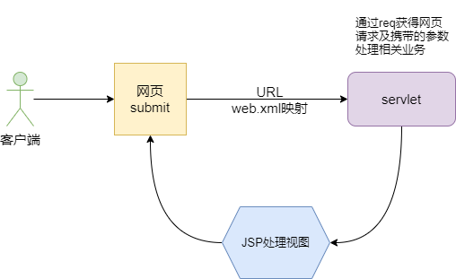
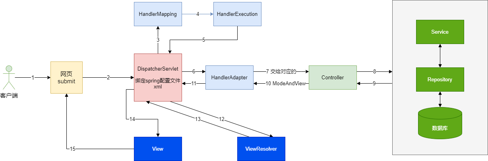

# 概述

从servlet到注解的hello world演进过程，了解这个过程主要因为原始的方法更加好理解原理。

# Servlet HelloWorld



 在项目`src/main/java`中实现一个servlet，我们可以看到，请求被xml中映射分析，发送到以下servlet中，然后在这里做业务处理，最后将返回结果，交给jsp视图去显示。

````java
//实现Servlet接口
public class HelloServlet extends HttpServlet {
    @Override
    protected void doGet(HttpServletRequest req, HttpServletResponse resp) throws ServletException, IOException {
        //取得参数
        String method = req.getParameter("method");
        if (method.equals("add")){
            req.getSession().setAttribute("msg","执行了add方法");
        }
        if (method.equals("delete")){
            req.getSession().setAttribute("msg","执行了delete方法");
        }
        //业务逻辑
        //视图跳转
        req.getRequestDispatcher("/WEB-INF/hello.jsp").forward(req,resp);
    }

    @Override
    protected void doPost(HttpServletRequest req, HttpServletResponse resp) throws ServletException, IOException {
        doGet(req,resp);k
    }
}
````

在`web/WEB-INF/web.xml`中配置servlet的映射。

```xml
<?xml version="1.0" encoding="UTF-8"?>
<web-app xmlns="http://xmlns.jcp.org/xml/ns/javaee"
         xmlns:xsi="http://www.w3.org/2001/XMLSchema-instance"
         xsi:schemaLocation="http://xmlns.jcp.org/xml/ns/javaee http://xmlns.jcp.org/xml/ns/javaee/web-app_4_0.xsd"
         version="4.0">

    <servlet>
        <servlet-name>HelloServlet</servlet-name>
        <servlet-class>HelloServlet</servlet-class>
    </servlet>
    <servlet-mapping>
        <servlet-name>HelloServlet</servlet-name>
        <url-pattern>/user</url-pattern>
    </servlet-mapping>
</web-app>
```

在`web/WEB-INF/hello.jsp`的jsp视图，做最后显示。

```jsp
<%@ page contentType="text/html;charset=UTF-8" language="java" %>
<html>
<head>
    <title>hello</title>
</head>
<body>
${msg}
</body>
</html>
```

# SpringMVC XML HelloWorld

在springMVC中所有请求都会委托给DispatcherServlet进行处理，它需要完成以下任务。



- Mapping，根据id或路径映射，请求映射，找到相应的controller
- 请求交给Controller，Controller处理之后返回数据和视图ViewAndModel
- 将数据和视图交给相应的ViewResolver进行处理
- 最终将View交给客户端做渲染

更详细的流程如下：

1）、客户端点击链接会发送 http://localhost:8080/springmvc/hello 请求
2）、来到tomcat服务器；
3）、SpringMVC的前端控制器收到所有请求；
4）、来看请求地址和@RequestMapping标注的哪个匹配，来找到到底使用那个类的哪个方法来处理
5）、前端控制器找到了目标处理器类和目标方法，直接利用返回执行目标方法；
6）、方法执行完成以后会有一个返回值；SpringMVC认为这个返回值就是要去的页面地址
7）、拿到方法返回值以后；用视图解析器进行拼串得到完整的页面地址；
8）、拿到页面地址，前端控制器帮我们转发到页面；

 dff sd在`web/WEB-INF/web.xml`中配置DispatchServlet，它绑定了spring的配置文件。

 ````xml
<?xml version="1.0" encoding="UTF-8"?>
<web-app xmlns="http://xmlns.jcp.org/xml/ns/javaee"
         xmlns:xsi="http://www.w3.org/2001/XMLSchema-instance"
         xsi:schemaLocation="http://xmlns.jcp.org/xml/ns/javaee http://xmlns.jcp.org/xml/ns/javaee/web-app_4_0.xsd"
         version="4.0">
    <servlet>
        <servlet-name>springmvc</servlet-name>
        <servlet-class>org.springframework.web.servlet.DispatcherServlet</servlet-class>
        <init-param>
            <param-name>contextConfigLocation</param-name>
            <param-value>classpath:springmvc-servlet.xml</param-value>
        </init-param>

        <load-on-startup>1</load-on-startup>
    </servlet>
    <servlet-mapping>
        <servlet-name>springmvc</servlet-name>
        <url-pattern>/</url-pattern>
    </servlet-mapping>
</web-app>
 ````

`src/main/resources/springmvc-servlet.xml`为spring容器的配置文件，需要在其中配置处理映射器，处理适配器，视图解析器，并且这里应该将后续的controller注入。

````xml
<?xml version="1.0" encoding="UTF-8"?>
<beans xmlns="http://www.springframework.org/schema/beans"
       xmlns:xsi="http://www.w3.org/2001/XMLSchema-instance"
       xsi:schemaLocation="http://www.springframework.org/schema/beans
       http://www.springframework.org/schema/beans/spring-beans.xsd">
    <!--    处理器映射器-->
    <bean class="org.springframework.web.servlet.handler.BeanNameUrlHandlerMapping"/>
    <!--    处理器适配器-->
    <bean class="org.springframework.web.servlet.mvc.SimpleControllerHandlerAdapter"/>
    <!--视图解析器:DispatcherServlet给他的ModelAndView-->
    <bean class="org.springframework.web.servlet.view.InternalResourceViewResolver" id="InternalResourceViewResolver">
        <!--前缀-->
        <property name="prefix" value="/WEB-INF/jsp/"/>
        <!--后缀-->
        <property name="suffix" value=".jsp"/>
    </bean>

<!--    &lt;!&ndash;Handler&ndash;&gt;-->
    <bean id="/hello" class="com.learning.springmvc.HelloController"/>
</beans>
````

编写controller

````java
public class HelloController implements Controller {
    @Override
    public ModelAndView handleRequest(HttpServletRequest httpServletRequest, HttpServletResponse httpServletResponse) throws Exception {
        ModelAndView view = new ModelAndView();
        // 业务
        String result = "hello spring";
        view.addObject("msg", result);
        view.setViewName("test");
        return view;
    }
}
````

`web/WEB-INF/jsp/hello.jsp`新建视图

```jsp
<%@ page contentType="text/html;charset=UTF-8" language="java" %>
<html>
<head>
    <title>Title</title>
</head>
<body>
${msg}

</body>
</html>
```


# SpringMVC Annotation HelloWorld

和xml配置类似。

在`web/WEB-INF/web.xml`中配置DispatchServlet，它绑定了spring的配置文件。

 ````xml
<?xml version="1.0" encoding="UTF-8"?>
<web-app xmlns="http://xmlns.jcp.org/xml/ns/javaee"
         xmlns:xsi="http://www.w3.org/2001/XMLSchema-instance"
         xsi:schemaLocation="http://xmlns.jcp.org/xml/ns/javaee http://xmlns.jcp.org/xml/ns/javaee/web-app_4_0.xsd"
         version="4.0">
    <servlet>
        <servlet-name>springmvc</servlet-name>
        <servlet-class>org.springframework.web.servlet.DispatcherServlet</servlet-class>
        <init-param>
            <param-name>contextConfigLocation</param-name>
            <param-value>classpath:springmvc-servlet.xml</param-value>
        </init-param>

        <load-on-startup>1</load-on-startup>
    </servlet>
    <servlet-mapping>
        <servlet-name>springmvc</servlet-name>
        <url-pattern>/</url-pattern>
    </servlet-mapping>
</web-app>
 ````

`src/main/resources/springmvc-servlet.xml`配置文件，直接配置注解和视图解析器。

```xml
<?xml version="1.0" encoding="UTF-8"?>
<beans xmlns="http://www.springframework.org/schema/beans"
       xmlns:xsi="http://www.w3.org/2001/XMLSchema-instance"
       xmlns:context="http://www.springframework.org/schema/context"
       xmlns:mvc="http://www.springframework.org/schema/mvc"
       xsi:schemaLocation="http://www.springframework.org/schema/beans
       http://www.springframework.org/schema/beans/spring-beans.xsd
       http://www.springframework.org/schema/context
       https://www.springframework.org/schema/context/spring-context.xsd
       http://www.springframework.org/schema/mvc
       https://www.springframework.org/schema/mvc/spring-mvc.xsd">

    <!-- 自动扫描包，让指定包下的注解生效,由IOC容器统一管理 -->
    <context:component-scan base-package="com.springmvc.helloworld"/>
    <!-- 让Spring MVC不处理静态资源 -->
    <mvc:default-servlet-handler />
    <!--
    支持mvc注解驱动
        在spring中一般采用@RequestMapping注解来完成映射关系
        要想使@RequestMapping注解生效
        必须向上下文中注册DefaultAnnotationHandlerMapping
        和一个AnnotationMethodHandlerAdapter实例
        这两个实例分别在类级别和方法级别处理。
        而annotation-driven配置帮助我们自动完成上述两个实例的注入。
     -->
    <mvc:annotation-driven />

    <!-- 视图解析器 -->
    <bean class="org.springframework.web.servlet.view.InternalResourceViewResolver"
          id="internalResourceViewResolver">
        <!-- 前缀 -->
        <property name="prefix" value="/WEB-INF/jsp/" />
        <!-- 后缀 -->
        <property name="suffix" value=".jsp" />
    </bean>

</beans>
```

编写controller和注解。

````java
@Controller
public class HelloController {
    @RequestMapping("/h1")
    public String hello(Model model) {
        model.addAttribute("msg", "hello springmvc");
        return "hello";
    }
}
````


