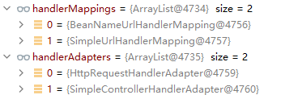
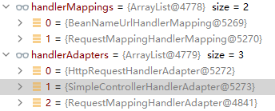
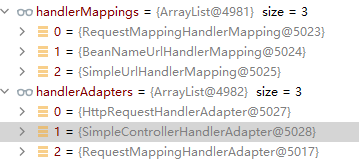
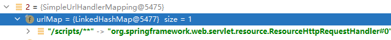

### web.xml都是继承tomcat中web.xml

DispatcherServlet配置`/`之后会拦截所有的请求，它和`/*`的区别是，`/*`优先级更高，`/`则优先级低。如何理解这个点。

例如tomcat的xml中其实默认配置了两个servlet。

````xml
<!-- The mapping for the default servlet -->
<servlet-mapping>
    <servlet-name>default</servlet-name>
    <url-pattern>/</url-pattern>
</servlet-mapping>

<!-- The mappings for the JSP servlet -->
<servlet-mapping>
    <servlet-name>jsp</servlet-name>
    <url-pattern>*.jsp</url-pattern>
    <url-pattern>*.jspx</url-pattern>
</servlet-mapping>
````

`/*`优先级更高，他会忽视其他拦截，拦截包括jsp的页面。`/`则优先级低，粒度更精确的优先级更高。

这里边有个继承的关系，我们配置了`/`让tomcat中配置的默认拦截器无效化，这可能会造成一些问题，例如说，你拦截了所有请求，但是controller中却只处理的部分。

### ` <mvc:annotation-driven>`和`<mvc:default-servlet-handler/>`

总结，RequestMappingHandlerMapping和SimpleUrlHandlerMapping分别是负责处理我们注解的自定义方法和tomcat默认的映射。在不启用这两个配置的时候默认使用前者，所以不能映射静态资源配置了`<mvc:default-servlet-handler/>`会让springMVC默认启用后者，而不启用前者。

```
<mvc:default-servlet-handler/> on
<mvc:annotation-driven></mvc:annotation-driven> off
```



SimpleUrlHandlerMapping映射的是`/**`，它会全都交给DefaultServletHttpRequestHandler，并且也配套使用HttpRequestHandleAdapter，所以这种情况下，它能够正常获取到静态资源。

````
<mvc:default-servlet-handler/> off
<mvc:annotation-driven></mvc:annotation-driven> off
````



少了SimpleUrlHandlerMapping，无法映射给tomcat，因而无法正常处理静态资源。

````
<mvc:default-servlet-handler/> on
<mvc:annotation-driven></mvc:annotation-driven> on
````



同时开启了之后，RequestMappingHandlerMapping和SimpleUrlHandlerMapping就都有了。

其实配置完之后还不可用，需要再加上配置如下，可能是新版的改了。

````
<mvc:resources mapping="/scripts/**" location="/WEB-INF/scripts/" />
````




