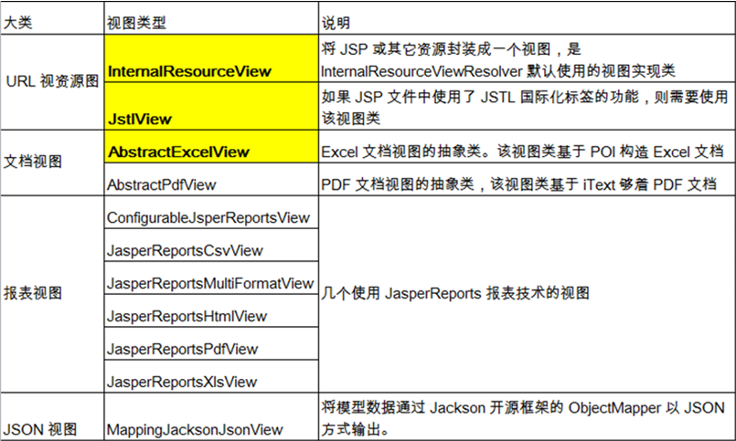
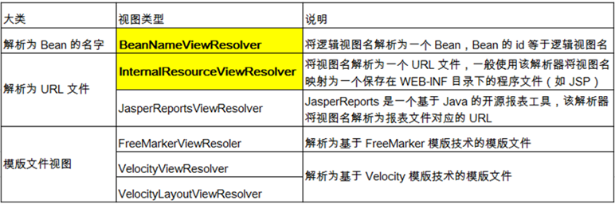

# 视图与视图解析器

视图的作用是渲染模型数据，将模型里的数据以某种形式呈现给客户。

常用的视图类。



常用的视图解析器。



每个视图解析器都实现了 Ordered 接口并开放出一个 order 属性，可以通过 order 属性指定解析器的优先顺序，order  越小优先级越高。

## 实例一，JstlView视图与国际化

`springmvc-servlet.xml`配置文件中配置解析器。

- 一个是指定jstlView视图类。
- 一个是指定管理器，将国际化交予springMVC进行管理。
  - 需要指定basename

````xml
<?xml version="1.0" encoding="UTF-8"?>
<beans xmlns="http://www.springframework.org/schema/beans"
       xmlns:xsi="http://www.w3.org/2001/XMLSchema-instance"
       xmlns:context="http://www.springframework.org/schema/context"
       xmlns:mvc="http://www.springframework.org/schema/mvc"
       xsi:schemaLocation="http://www.springframework.org/schema/beans
       http://www.springframework.org/schema/beans/spring-beans.xsd
       http://www.springframework.org/schema/context
       https://www.springframework.org/schema/context/spring-context.xsd
       http://www.springframework.org/schema/mvc
       https://www.springframework.org/schema/mvc/spring-mvc.xsd">

    <!-- 自动扫描包，让指定包下的注解生效,由IOC容器统一管理 -->
    <context:component-scan base-package="com.springmvc.viewresolver"/>
    <!-- 让Spring MVC不处理静态资源 -->
    <mvc:default-servlet-handler />
    <!--
    支持mvc注解驱动
        在spring中一般采用@RequestMapping注解来完成映射关系
        要想使@RequestMapping注解生效
        必须向上下文中注册DefaultAnnotationHandlerMapping
        和一个AnnotationMethodHandlerAdapter实例
        这两个实例分别在类级别和方法级别处理。
        而annotation-driven配置帮助我们自动完成上述两个实例的注入。
     -->
    <mvc:annotation-driven />

    <!-- 视图解析器 -->
    <bean class="org.springframework.web.servlet.view.InternalResourceViewResolver"
          id="internalResourceViewResolver">
        <!--  指定解析返回的view-->
        <property name="viewClass" value="org.springframework.web.servlet.view.JstlView"/>
        <property name="prefix" value="/WEB-INF/jsp/"/>
        <property name="suffix" value=".jsp"/>
    </bean>
    <!-- 指定让springMVC管理国际化文件，id必须是messageSource -->
    <bean id="messageSource" class="org.springframework.context.support.ResourceBundleMessageSource">
        <property name="basename" value="i18n"></property>
    </bean>
</beans>
````

编辑国际化资源，资源放在resources中可以被正常访问。

i18n_en_US.properties：

````properties
welcomeinfo=WELCOME
username=USERNAME
password=PASSWORD
loginBtn=LOGIN
````

i18n_en_US.properties:

````properties
welcomeinfo=欢迎
username=用户名
password=密码
loginBtn=登陆
````

编写jsp页面。注意引入fmt标签。

````jsp
<%@ page contentType="text/html;charset=UTF-8" language="java" %>
<%@taglib prefix="fmt" uri="http://java.sun.com/jsp/jstl/fmt" %>
<html>
<head>
    <title>Title</title>
</head>
<body>
<h1>
    <fmt:message key="welcomeinfo"></fmt:message>
</h1>
<form action="">
    <fmt:message key="username"/><br>
    <fmt:message key="password"/><br>
</form>
</body>
</html>
````

## 案例二，自定义视图

自定义视图和视图解析器，解析自定义请求。

````java
@Controller
public class HelloController {
    @RequestMapping("myhello")
    public String myHello() {
        return "kdl:myhello";
    }
}
````

自定义视图解析器。

- 实现解析器接口，该方法将会在controller方法调用后，在渲染mv的时候被调用
- 实现Ordered接口，该方法能指定解析器优先级，默认都是最低优先级

````java
public class MyViewResolver implements ViewResolver, Ordered {

    private int order = Integer.MAX_VALUE;
    @Override
    public View resolveViewName(String viewName, Locale locale) throws Exception {
        if (viewName.startsWith("kdl:")) {
            return new MyView();
        }
        return null;
    }
    
    public void setOrder(int order) {
        this.order = order;
    }

    @Override
    public int getOrder() {
        return order;
    }
}
````

自定义视图

````java
public class MyView implements View {

    @Override
    public String getContentType() {
        return "text/html";
    }

    @Override
    public void render(Map<String, ?> model, HttpServletRequest request, HttpServletResponse response) throws Exception {
        response.getWriter().println("HelloView - time = " + new Date());
    }
}
````

spring配置文件中配置视图解析器。

````xml
<bean class="MyViewResolver">
    <property name="order" value="100"/>
</bean>
````

# 数据校验

数据校验；只做前端校验是不安全的；在重要数据一定要加上后端验证；

- 可以写程序将我们每一个数据取出进行校验，如果失败直接来到添加页面，提示其重新填写；x
- SpringMVC；可以JSR303来做数据校验
  - JDBC:规范---实现（各个厂商的驱动包）
  - JSR303：规范-----Hibernate Validator（第三方校验框架）
    - JSR规范是Java的规范提案（**Java Specification Requests**），其实就是某个领域的约定标准，约定高于一切。关于JSR303，它定义了数据合法性的多个注解https://www.jianshu.com/p/554533f88370

**后端校验的使用**

- 导入校验框架的jar包
- 只需要给javaBean的属性添加上校验注解
- 在SpringMVC封装对象的时候，告诉SpringMVC这个javaBean需要校验
- 如何知道校验结果；给需要校验的javaBean后面紧跟一个BindingResult。这个BindingResult就是封装前一个bean的校验结果；
- 通过`<form:errors>`可以回显信息

# 拦截器

## 使用

- 继承拦截器接口
- springMVC中配置拦截器，可以配置多个

拦截器有三个方法，从方法名就可以获知生命周期。

````java
public class MyFirstInterceptor implements HandlerInterceptor {
    @Override
    public boolean preHandle(HttpServletRequest request, HttpServletResponse response, Object handler) throws Exception {
        System.out.println("preHandle");
		// 拦截器return true表示放行，false表示拦截
        return true;
    }

    @Override
    public void postHandle(HttpServletRequest request, HttpServletResponse response, Object handler, ModelAndView modelAndView) throws Exception {
        System.out.println("postHandle");
    }

    @Override
    public void afterCompletion(HttpServletRequest request, HttpServletResponse response, Object handler, Exception ex) throws Exception {
        System.out.println("afterComplete");
    }
}
````

## 源码解析

拦截器的执行有几个特地，需要靠源代码阅读才能够很好理解。

- 为什么post的方法是反着执行的
- 为什么后面的拦截器return false之后，只有前面的拦截器completion方法会执行
- 为什么发生异常的时候，只有前面的拦截器的completion方法会执行

梦开始的地方
- 核心方法有三个applyPreHandle，applyPostHandle，triggerAfterCompletion
- triggerAfterCompletion只遍历正常执行过的拦截器，在pre执行过程中有标记
- 需要关注发生异常后，对于completion方法的调用时机。

````java
/**
梦开始的地方
- 核心方法有三个applyPreHandle，applyPostHandle，triggerAfterCompletion
- 需要关注发生异常后，对于completion方法的调用时机。
 */


protected void doDispatch(HttpServletRequest request, HttpServletResponse response) throws Exception {
	try {

		try {

			// 获得handler
			mappedHandler = getHandler(processedRequest);
			// 获得adapter
			HandlerAdapter ha = getHandlerAdapter(mappedHandler.getHandler());

			// 执行preHandle的系列方法
			if (!mappedHandler.applyPreHandle(processedRequest, response)) {
				return;
			}

			// 执行方法
			mv = ha.handle(processedRequest, response, mappedHandler.getHandler());
			// 正常流程这里会执行postHandle方法
			mappedHandler.applyPostHandle(processedRequest, response, mv);
		}
		catch (Exception ex) {
			dispatchException = ex;
		}
		catch (Throwable err) {
		}
		// 这里处理跳转，并执行completion方法
		processDispatchResult(processedRequest, response, mappedHandler, mv, dispatchException);
	}
	catch (Exception ex) {
		// 如果出现异常，方法将会调用processDispatchResult跳转异常界面，然后抛出异常
		// 这里会调用triggerAfterCompletion方法
		triggerAfterCompletion(processedRequest, response, mappedHandler, ex);
	}
	catch (Throwable err) {
		// 异常调用会调用triggerAfterCompletion方法
		triggerAfterCompletion(processedRequest, response, mappedHandler,
				new NestedServletException("Handler processing failed", err));
	}
	finally {

	}
}


// 执行拦截器的preHandle方法
boolean applyPreHandle(HttpServletRequest request, HttpServletResponse response) throws Exception {
	HandlerInterceptor[] interceptors = getInterceptors();
	if (!ObjectUtils.isEmpty(interceptors)) {
		// 遍历执行
		for (int i = 0; i < interceptors.length; i++) {
			HandlerInterceptor interceptor = interceptors[i];
			if (!interceptor.preHandle(request, response, this.handler)) {
				// 执行失败，即if语句中返回false，这里会开始执行interceptorIndex之前的所有方法
				// 这也就能解释为什么即使return false，之前拦截器的completion方法都会被执行
				triggerAfterCompletion(request, response, null);
				return false;
			}
			// 记录执行到哪个拦截器
			this.interceptorIndex = i;
		}
	}
	return true;
}

// 正常流程执行postHandle方法
void applyPostHandle(HttpServletRequest request, HttpServletResponse response, @Nullable ModelAndView mv)
		throws Exception {

	HandlerInterceptor[] interceptors = getInterceptors();
	if (!ObjectUtils.isEmpty(interceptors)) {
		// 逆序遍历，这也就能解释为什么post方法是反向的
		for (int i = interceptors.length - 1; i >= 0; i--) {
			HandlerInterceptor interceptor = interceptors[i];
			interceptor.postHandle(request, response, this.handler, mv);
		}
	}
}

// 执行completion方法
void triggerAfterCompletion(HttpServletRequest request, HttpServletResponse response, @Nullable Exception ex)
		throws Exception {

	HandlerInterceptor[] interceptors = getInterceptors();
	if (!ObjectUtils.isEmpty(interceptors)) {
		// 唯一值得注意的一点是，这里只遍历正常执行过的拦截器，interceptorIndex标记
		for (int i = this.interceptorIndex; i >= 0; i--) {
			HandlerInterceptor interceptor = interceptors[i];
			try {
				interceptor.afterCompletion(request, response, this.handler, ex);
			}
			catch (Throwable ex2) {
				logger.error("HandlerInterceptor.afterCompletion threw exception", ex2);
			}
		}
	}
}


````


