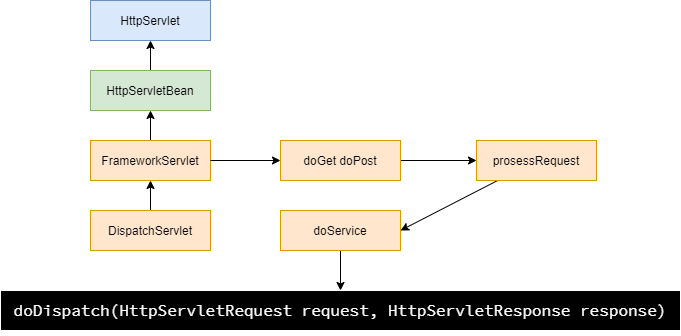

# DispatcherServlet核心逻辑

DispatcherServlet处理逻辑如下。

1. 获得对应handler，即自定义的controller
2. 获得对应的handler adapter
3. 适配器调用用户自定义方法，返回model和view
4. 处理和显示视图
5. 跳转页面





````java
protected void doDispatch(HttpServletRequest request, HttpServletResponse response) throws Exception {
	HttpServletRequest processedRequest = request;
	HandlerExecutionChain mappedHandler = null;
	boolean multipartRequestParsed = false;
	WebAsyncManager asyncManager = WebAsyncUtils.getAsyncManager(request);
	try {
		ModelAndView mv = null;
		Exception dispatchException = null;
		try {
            // 1. 检查是否上传文件
			processedRequest = checkMultipart(request);
			multipartRequestParsed = (processedRequest != request);
            // 2. 获得handler，即对应的处理器
			// Determine handler for the current request.
			mappedHandler = getHandler(processedRequest);
			if (mappedHandler == null) {
				noHandlerFound(processedRequest, response);
				return;
			}
            // 3. 获得适配器，用于组合使用处理器
			// Determine handler adapter for the current request.
			HandlerAdapter ha = getHandlerAdapter(mappedHandler.getHandler());
			// Process last-modified header, if supported by the handler.
			String method = request.getMethod();
			boolean isGet = "GET".equals(method);
			if (isGet || "HEAD".equals(method)) {
				long lastModified = ha.getLastModified(request, mappedHandler.getHandler());
				if (new ServletWebRequest(request, response).checkNotModified(lastModified) && isGet) {
					return;
				}
			}
			if (!mappedHandler.applyPreHandle(processedRequest, response)) {
				return;
			}
            //4.  适配器调用用户自定义方法，返回model和view
			// Actually invoke the handler.
			mv = ha.handle(processedRequest, response, mappedHandler.getHandler());
			if (asyncManager.isConcurrentHandlingStarted()) {
				return;
			}
            // 5. 处理视图
			applyDefaultViewName(processedRequest, mv);
			mappedHandler.applyPostHandle(processedRequest, response, mv);
		}
		catch (Exception ex) {
			dispatchException = ex;
		}
		catch (Throwable err) {
			// As of 4.3, we're processing Errors thrown from handler methods as well,
			// making them available for @ExceptionHandler methods and other scenarios.
			dispatchException = new NestedServletException("Handler dispatch failed", err);
		}
        // 6. 处理跳转
		processDispatchResult(processedRequest, response, mappedHandler, mv, dispatchException);
	}
	catch (Exception ex) {
		triggerAfterCompletion(processedRequest, response, mappedHandler, ex);
	}
	catch (Throwable err) {
		triggerAfterCompletion(processedRequest, response, mappedHandler,
				new NestedServletException("Handler processing failed", err));
	}
	finally {
		if (asyncManager.isConcurrentHandlingStarted()) {
			// Instead of postHandle and afterCompletion
			if (mappedHandler != null) {
				mappedHandler.applyAfterConcurrentHandlingStarted(processedRequest, response);
			}
		}
		else {
			// Clean up any resources used by a multipart request.
			if (multipartRequestParsed) {
				cleanupMultipart(processedRequest);
			}
		}
	}
}
````

## getHandler

来看getHandler方法

方法遍历几个handlerMappings，尝试从这几个映射map中取出request中地址对应的controller
注意这几个mappings底层实际上就是linkedHashMap。

- RequestMappingHandler
- BeanNameUrlHandlerMapping
- SimpleUrlHandlerMapping

从名字可以看出，就是对应着几个基础的容器的mapping。

````java
protected HandlerExecutionChain getHandler(HttpServletRequest request) throws Exception {
	if (this.handlerMappings != null) {
		for (HandlerMapping mapping : this.handlerMappings) {
			HandlerExecutionChain handler = mapping.getHandler(request);
			if (handler != null) {
				return handler;
			}
		}
	}
	return null;
}
````

## getAdapter

同理。

同理遍历几个适配器，找到合适的handler的适配器。这里应该使用了适配器模式，为不同的handler实现了不同的适配器接口

可以进行统一的调用。

适配器包括

- HttpRequestHandlerAdapter

- SimpleControllerHandlerAdapter

- RequestMappingHandlerAdapter

````java

protected HandlerAdapter getHandlerAdapter(Object handler) throws ServletException {
	if (this.handlerAdapters != null) {
		for (HandlerAdapter adapter : this.handlerAdapters) {
			if (adapter.supports(handler)) {
				return adapter;
			}
		}
	}
	throw new ServletException("No adapter for handler [" + handler +
			"]: The DispatcherServlet configuration needs to include a HandlerAdapter that supports this handler");
}

// handlerAdapter接口
public interface HandlerAdapter {
	boolean supports(Object handler);
	ModelAndView handle(HttpServletRequest request, HttpServletResponse response, Object handler) throws Exception;
	long getLastModified(HttpServletRequest request, Object handler);

}
````

## processDispatchResult

````java
//调用该方法进行渲染视图
render(mv, request, response);
````

# SpringMVC九大组件

````JAVA
/* 
九大组件
 */
protected void initStrategies(ApplicationContext context) {
    // 文件上传解析器
	initMultipartResolver(context);
    // 区域信息解析器
	initLocaleResolver(context);
    // 主题解析器
	initThemeResolver(context);
    // handler映射器
	initHandlerMappings(context);
    // handler适配器
	initHandlerAdapters(context);
    // 异常解析器
	initHandlerExceptionResolvers(context);
	initRequestToViewNameTranslator(context);
    // 视图解析器
	initViewResolvers(context);
    // 重定向携带数据
	initFlashMapManager(context);
}
````

## 初始化

初始化策略都非常类似。

1. 从app context中获取bean
2. 获取不到则使用默认的

````JAVA
/* 
1. 从app context中获取bean
2. 获取不到则使用默认的

 */
private void initHandlerMappings(ApplicationContext context) {
	this.handlerMappings = null;
	if (this.detectAllHandlerMappings) {
        // 从容器中获取
		Map<String, HandlerMapping> matchingBeans =
				BeanFactoryUtils.beansOfTypeIncludingAncestors(context, HandlerMapping.class, true, false);
		if (!matchingBeans.isEmpty()) {
			this.handlerMappings = new ArrayList<>(matchingBeans.values());
			AnnotationAwareOrderComparator.sort(this.handlerMappings);
		}
	}
	else {
		try {
			HandlerMapping hm = context.getBean(HANDLER_MAPPING_BEAN_NAME, HandlerMapping.class);
			this.handlerMappings = Collections.singletonList(hm);
		}
		catch (NoSuchBeanDefinitionException ex) {}
	}

	if (this.handlerMappings == null) {
        // 获取默认的
		this.handlerMappings = getDefaultStrategies(context, HandlerMapping.class);
		if (logger.isTraceEnabled()) {
			logger.trace("No HandlerMappings declared for servlet '" + getServletName() +
					"': using default strategies from DispatcherServlet.properties");
		}
	}
}
````

# 方法执行过程

DispatcherServlet映射请求之后，需要执行对应的方法。

## 核心逻辑

- 初始化，建造了工厂，并且完成容器中bean的各种初始化

- 初始化数据模型，在这里`@ModelAttribute`注解的方法会被调用
  - 执行`@ModelAttribute`方法
    - 获取参数
    - 执行方法
- 执行handle方法
  - 执行`@requestMapping`方法
    - 获取参数
    - 执行方法

在获取参数的时候，逻辑都是类似的。

- 获取已经初始化好的参数列表
- 调用对应的参数解析器进行解析，这些参数解析器都实现了各自的解析接口

执行方法的时候，逻辑都是类似的

- 执行方法前需要解析参数
- 如果参数带有`@ModelAttribute`标注，说明之前被初始化过，或者直接使用默认的变量名去看看model里有没有已有的对象，优先取出已有对象方便全字段更新业务

````java
protected ModelAndView invokeHandlerMethod(HttpServletRequest request,
		HttpServletResponse response, HandlerMethod handlerMethod) throws Exception {
	ServletWebRequest webRequest = new ServletWebRequest(request, response);
	try {
        // 工厂方法，初始化容器中的bean
		WebDataBinderFactory binderFactory = getDataBinderFactory(handlerMethod);
		ModelFactory modelFactory = getModelFactory(handlerMethod, binderFactory);
		ServletInvocableHandlerMethod invocableMethod = createInvocableHandlerMethod(handlerMethod);
		if (this.argumentResolvers != null) {
			invocableMethod.setHandlerMethodArgumentResolvers(this.argumentResolvers);
		}
		if (this.returnValueHandlers != null) {
			invocableMethod.setHandlerMethodReturnValueHandlers(this.returnValueHandlers);
		}
		invocableMethod.setDataBinderFactory(binderFactory);
		invocableMethod.setParameterNameDiscoverer(this.parameterNameDiscoverer);
		ModelAndViewContainer mavContainer = new ModelAndViewContainer();
		mavContainer.addAllAttributes(RequestContextUtils.getInputFlashMap(request));
        // 初始化模型，在这里注解ModelAttribute的方法会被调用，数据会被保存到model中
		modelFactory.initModel(webRequest, mavContainer, invocableMethod);
		mavContainer.setIgnoreDefaultModelOnRedirect(this.ignoreDefaultModelOnRedirect);
		AsyncWebRequest asyncWebRequest = WebAsyncUtils.createAsyncWebRequest(request, response);
		asyncWebRequest.setTimeout(this.asyncRequestTimeout);
		WebAsyncManager asyncManager = WebAsyncUtils.getAsyncManager(request);
		asyncManager.setTaskExecutor(this.taskExecutor);
		asyncManager.setAsyncWebRequest(asyncWebRequest);
		asyncManager.registerCallableInterceptors(this.callableInterceptors);
		asyncManager.registerDeferredResultInterceptors(this.deferredResultInterceptors);
		if (asyncManager.hasConcurrentResult()) {
			Object result = asyncManager.getConcurrentResult();
			mavContainer = (ModelAndViewContainer) asyncManager.getConcurrentResultContext()[0];
			asyncManager.clearConcurrentResult();
			LogFormatUtils.traceDebug(logger, traceOn -> {
				String formatted = LogFormatUtils.formatValue(result, !traceOn);
				return "Resume with async result [" + formatted + "]";
			});
			invocableMethod = invocableMethod.wrapConcurrentResult(result);
		}
        // 执行方法
		invocableMethod.invokeAndHandle(webRequest, mavContainer);
		if (asyncManager.isConcurrentHandlingStarted()) {
			return null;
		}
		return getModelAndView(mavContainer, modelFactory, webRequest);
	}
	finally {
		webRequest.requestCompleted();
	}
}
````

## 反射执行handle

handle调用自定义的controller方法，可以利用反射机制实现，但是controller的参数如何确定？我们知道，参数是由我们指定的，并且当使用`@ModelAttribute`的时候，全字段更新还需要使用已有的对象。

以下方法为初始化过程中，查找例如`@ModelAttribute`注解的方法的调用，初始化Model中一些已有对象。

核心逻辑是：

1. 遍历所有方法
2. 执行ModelAttribute注解的方法

````java
// 该方法为modelFatory的方法
private void invokeModelAttributeMethods(NativeWebRequest request, ModelAndViewContainer container)
	throws Exception {
    // modelMethods为初始化之后保存的方法对象，遍历
    while (!this.modelMethods.isEmpty()) {
        InvocableHandlerMethod modelMethod = getNextModelMethod(container).getHandlerMethod();
        ModelAttribute ann = modelMethod.getMethodAnnotation(ModelAttribute.class);
        Assert.state(ann != null, "No ModelAttribute annotation");
        if (container.containsAttribute(ann.name())) {
            if (!ann.binding()) {
                container.setBindingDisabled(ann.name());
            }
            continue;
        }
        // 执行ModelAttribute注解的方法
        Object returnValue = modelMethod.invokeForRequest(request, container);
        if (!modelMethod.isVoid()){
            String returnValueName = getNameForReturnValue(returnValue, modelMethod.getReturnType());
            if (!ann.binding()) {
                container.setBindingDisabled(returnValueName);
            }
            if (!container.containsAttribute(returnValueName)) {
                container.addAttribute(returnValueName, returnValue);
            }
        }
    }
}
````

### 反射方法的执行

方法的执行基本没有差别：

1. 获取参数
2. 反射执行方法

````java
// 执行调用invokeForRequest
public Object invokeForRequest(NativeWebRequest request, @Nullable ModelAndViewContainer mavContainer,
        Object... providedArgs) throws Exception {
    // 获得参数
    Object[] args = getMethodArgumentValues(request, mavContainer, providedArgs);
    if (logger.isTraceEnabled()) {
        logger.trace("Arguments: " + Arrays.toString(args));
    }
    // 执行
    return doInvoke(args);
}
````

### 获取参数

参数获取都是，获取所有参数，遍历调用参数解析方法。

```java
protected Object[] getMethodArgumentValues(NativeWebRequest request, @Nullable ModelAndViewContainer mavContainer,
        Object... providedArgs) throws Exception {
    // 获得所有参数列表，这些参数在初始化阶段被初始化 
    MethodParameter[] parameters = getMethodParameters();
    if (ObjectUtils.isEmpty(parameters)) {
        return EMPTY_ARGS;
    }

    Object[] args = new Object[parameters.length];
    for (int i = 0; i < parameters.length; i++) {
        MethodParameter parameter = parameters[i];
        parameter.initParameterNameDiscovery(this.parameterNameDiscoverer);
        args[i] = findProvidedArgument(parameter, providedArgs);
        if (args[i] != null) {
            continue;
        }
        if (!this.resolvers.supportsParameter(parameter)) {
            throw new IllegalStateException(formatArgumentError(parameter, "No suitable resolver"));
        }
        try {
            // 解析参数
            args[i] = this.resolvers.resolveArgument(parameter, mavContainer, request, this.dataBinderFactory);
        }
        catch (Exception ex) {
            if (logger.isDebugEnabled()) {
                String exMsg = ex.getMessage();
                if (exMsg != null && !exMsg.contains(parameter.getExecutable().toGenericString())) {
                    logger.debug(formatArgumentError(parameter, exMsg));
                }
            }
            throw ex;
        }
    }
    return args;
}
```

不同解析对象实现了参数解析接口

````java
// 不同解析器对象都实现了参数解析接口
public interface HandlerMethodArgumentResolver {

	boolean supportsParameter(MethodParameter parameter);

	@Nullable
	Object resolveArgument(MethodParameter parameter, @Nullable ModelAndViewContainer mavContainer,
			NativeWebRequest webRequest, @Nullable WebDataBinderFactory binderFactory) throws Exception;

}
````

以modelAttribute为例，来看实现参数解析的过程

1. 获得`ModelAttribute`的value属性，该属性标记已有对象的id（也是变量名）
2. 查看model中是否已经有该对象，没有则新建
3. 根据web请求中的数据，封装更新对应字段

````java
// 来看modelAttribute的参数解析的实现
public final Object resolveArgument(MethodParameter parameter, @Nullable ModelAndViewContainer mavContainer,
		NativeWebRequest webRequest, @Nullable WebDataBinderFactory binderFactory) throws Exception {
	Assert.state(mavContainer != null, "ModelAttributeMethodProcessor requires ModelAndViewContainer");
	Assert.state(binderFactory != null, "ModelAttributeMethodProcessor requires WebDataBinderFactory");
    // 通过ModelFactor获得参数名，这边如果没有在参数注解，则默认用变量名去查看model中有没有
	String name = ModelFactory.getNameForParameter(parameter);
	ModelAttribute ann = parameter.getParameterAnnotation(ModelAttribute.class);
	if (ann != null) {
		mavContainer.setBinding(name, ann.binding());
	}
	Object attribute = null;
	BindingResult bindingResult = null;
    // model中是否包含该对象
	if (mavContainer.containsAttribute(name)) {
		attribute = mavContainer.getModel().get(name);
	}
    // 不包含则新建
	else {
		try {
			attribute = createAttribute(name, parameter, binderFactory, webRequest);
		}
		catch (BindException ex) {
			if (isBindExceptionRequired(parameter)) {
				throw ex;
			}
			if (parameter.getParameterType() == Optional.class) {
				attribute = Optional.empty();
			}
			bindingResult = ex.getBindingResult();
		}
	}
    // 封装web请求中携带的新数据
	if (bindingResult == null) {
		WebDataBinder binder = binderFactory.createBinder(webRequest, attribute, name);
		if (binder.getTarget() != null) {
			if (!mavContainer.isBindingDisabled(name)) {
                // 绑定更新，从webRequest自动封装到model（初始化数据容器）中的对应对象中
				bindRequestParameters(binder, webRequest);
			}
			validateIfApplicable(binder, parameter);
			if (binder.getBindingResult().hasErrors() && isBindExceptionRequired(binder, parameter)) {
				throw new BindException(binder.getBindingResult());
			}
		}
		if (!parameter.getParameterType().isInstance(attribute)) {
			attribute = binder.convertIfNecessary(binder.getTarget(), parameter.getParameterType(), parameter);
		}
		bindingResult = binder.getBindingResult();
	}
	Map<String, Object> bindingResultModel = bindingResult.getModel();
	mavContainer.removeAttributes(bindingResultModel);
	mavContainer.addAllAttributes(bindingResultModel);
	return attribute;
}
````

# 视图解析过程

## 核心逻辑

DispatcherServlet中获得mv之后处理转发结果。

````java
// DispatcherServlet::doDispatch
protected void doDispatch(HttpServletRequest request, HttpServletResponse response) throws Exception {
	try {
		// ......
		// 处理转发结果，mv中已经有转发地址success
		processDispatchResult(processedRequest, response, mappedHandler, mv, dispatchException);
		// 该方法最终调用了DispatcherServlet中的render渲染
	}
}
````

调用该类下的render方法进行渲染。

- 获得视图名，解析视图
  - 解析视图方法会遍历所有视图解析器（xml中配置的），这些解析器实现了各自的解析方法，解析视图
    - 遍历所有视图解析器，尝试解析视图
    - 检查是否有缓存，没有则创建
    - 创建视图会根据我们的controller方法返回的地址前缀创建对应的视图，如果没有指定，则创建xml中配置的视图解析
  - 解析视图过程中会将转发地址“success”补全前后缀（配置了InternalResourceViewResolver）
- 渲染视图
  - 将mv中的数据全部写入request原生对象中
  - request对象将使用转发器进行转发

````java
// DispatcherServlet::render
protected void render(ModelAndView mv, HttpServletRequest request, HttpServletResponse response) throws Exception {

	Locale locale =(this.localeResolver != null ? this.localeResolver.resolveLocale(request) : request.getLocale());
	response.setLocale(locale);
	View view;
	// 从mv中获得视图名
	String viewName = mv.getViewName();
	if (viewName != null) {
		// 开始解析view
		view = resolveViewName(viewName, mv.getModelInternal(), locale, request);
		if (view == null) {
			throw new ServletException("Could not resolve view with name '" + mv.getViewName() +
					"' in servlet with name '" + getServletName() + "'");
		}
	}
	else {
		//.....默认视图
	}
	try {
		if (mv.getStatus() != null) {
			response.setStatus(mv.getStatus().value());
		}
		// 调用视图本身的渲染方法
		view.render(mv.getModelInternal(), request, response);
	}
	catch (Exception ex) {
		if (logger.isDebugEnabled()) {
			logger.debug("Error rendering view [" + view + "]", ex);
		}
		throw ex;
	}
}
````

## 解析视图

遍历所有视图解析器，解析视图

````java
// DispatcherServlet::resolveViewName
// 解析视图
protected View resolveViewName(String viewName, @Nullable Map<String, Object> model,
		Locale locale, HttpServletRequest request) throws Exception {
	if (this.viewResolvers != null) {
		// 遍历所有解析器，解析器是在bean初始化过程中装载的，此时将会调用
		// InternalResourceViewResolver -> UrlBasedViewResolver -> AbstractCachingViewResolver
		// -> WebApplicationObjectSupport
		// AbstractCachingViewResolver实现了ViewResolver接口的resolveViewName方法
		for (ViewResolver viewResolver : this.viewResolvers) {
			// 调用解析器的解析方法
			View view = viewResolver.resolveViewName(viewName, locale);
			if (view != null) {
				return view;
			}
		}
	}
	return null;
}
````

AbstractCachingViewResolver实现了resolveViewName。

- 判断是否有缓存
- 创建视图
- 放入缓存
  - 这有两处缓存，访问缓存
  - 创建缓存

````java
// AbstractCachingViewResolver::resolveViewName
// AbstractCachingViewResolver实现了ViewResolver接口的resolveViewName方法
public View resolveViewName(String viewName, Locale locale) throws Exception {
	// 是否开启缓存，不开启的话则直接创建
	if (!isCache()) {
		return createView(viewName, locale);
	}
	else {
		// 查看缓存中是否已存在视图
		Object cacheKey = getCacheKey(viewName, locale);
		View view = this.viewAccessCache.get(cacheKey); // 注意此处有两个缓存，创建缓存和访问缓存
		// 不存在则创建
		if (view == null) {
			// 同步加锁操作创建视图，操作缓存
			synchronized (this.viewCreationCache) {
				// 查看创建缓存中是否存在
				view = this.viewCreationCache.get(cacheKey);
				if (view == null) {
					// 不存在，创建视图
					// AbstractCachingViewResolver自己抽象了，调用了UrlBasedViewResolver子类的方法
					view = createView(viewName, locale);
					if (view == null && this.cacheUnresolved) {
						view = UNRESOLVED_VIEW;
					}
					// 写入缓存
					if (view != null) {
						this.viewAccessCache.put(cacheKey, view);
						this.viewCreationCache.put(cacheKey, view);
					}
				}
			}
		}
		else {
			if (logger.isTraceEnabled()) {
				logger.trace(formatKey(cacheKey) + "served from cache");
			}
		}
		return (view != UNRESOLVED_VIEW ? view : null);
	}
}
````

创建视图

- 判断需要创建的视图，创建之
- 补全转发地址

````java
// UrlBasedViewResolver::createView 子类的方法
protected View createView(String viewName, Locale locale) throws Exception {
	if (!canHandle(viewName, locale)) {
		return null;
	}
	// 判断是否重定向视图
	if (viewName.startsWith(REDIRECT_URL_PREFIX)) {
		String redirectUrl = viewName.substring(REDIRECT_URL_PREFIX.length());
		// 新建重定向视图
		RedirectView view = new RedirectView(redirectUrl,
				isRedirectContextRelative(), isRedirectHttp10Compatible());
		String[] hosts = getRedirectHosts();
		if (hosts != null) {
			view.setHosts(hosts);
		}
		return applyLifecycleMethods(REDIRECT_URL_PREFIX, view);
	}
	// 判断是否转发视图
	if (viewName.startsWith(FORWARD_URL_PREFIX)) {
		String forwardUrl = viewName.substring(FORWARD_URL_PREFIX.length());
		// 新建转发视图
		InternalResourceView view = new InternalResourceView(forwardUrl);
		return applyLifecycleMethods(FORWARD_URL_PREFIX, view);
	}
	// 否则调用父类中的createView方法
	// 父类AbstractCachingViewResolver实际上调了抽象方法loadView(viewName, locale)
	// loadView(viewName, locale)在UrlBasedViewResolver中被实现
    // loadView调用了buildView方法，该方法在InternalResourceViewResolver
	return super.createView(viewName, locale);
}
//InternalResourceViewResolver::buildView
AbstractUrlBasedView buildView(String viewName) throws Exception {
	// 调用了父类的方法，并强转为InternalResourceView
	InternalResourceView view = (InternalResourceView) super.buildView(viewName);
	if (this.alwaysInclude != null) {
		view.setAlwaysInclude(this.alwaysInclude);
	}
	view.setPreventDispatchLoop(true);
	return view;
}
//UrlBasedViewResolver::buildView
// super.buildView(viewName);
protected AbstractUrlBasedView buildView(String viewName) throws Exception {
	Class<?> viewClass = getViewClass();
	Assert.state(viewClass != null, "No view class");
	// 初始化
	AbstractUrlBasedView view = (AbstractUrlBasedView) BeanUtils.instantiateClass(viewClass);
	// 前缀后缀补全
	view.setUrl(getPrefix() + viewName + getSuffix());
	String contentType = getContentType();
	if (contentType != null) {
		view.setContentType(contentType);
	}
	view.setRequestContextAttribute(getRequestContextAttribute());
	view.setAttributesMap(getAttributesMap());
	Boolean exposePathVariables = getExposePathVariables();
	if (exposePathVariables != null) {
		view.setExposePathVariables(exposePathVariables);
	}
	Boolean exposeContextBeansAsAttributes = getExposeContextBeansAsAttributes();
	if (exposeContextBeansAsAttributes != null) {
		view.setExposeContextBeansAsAttributes(exposeContextBeansAsAttributes);
	}
	String[] exposedContextBeanNames = getExposedContextBeanNames();
	if (exposedContextBeanNames != null) {
		view.setExposedContextBeanNames(exposedContextBeanNames);
	}
	return view;
}

````

## 渲染转发

解析得到视图之后，调用视图的转发方法

- 将mv中存在的数据写入request
- 跳转

````java
// view.render(mv.getModelInternal(), request, response);
// AbstractView中的，赋值渲染视图
public void render(@Nullable Map<String, ?> model, HttpServletRequest request,
		HttpServletResponse response) throws Exception {
	if (logger.isDebugEnabled()) {
		logger.debug("View " + formatViewName() +
				", model " + (model != null ? model : Collections.emptyMap()) +
				(this.staticAttributes.isEmpty() ? "" : ", static attributes " + this.staticAttributes));
	}
	Map<String, Object> mergedModel = createMergedOutputModel(model, request, response);
	prepareResponse(request, response);
	// 渲染最终的合并模型
	// AbstractView中为抽象方法，在子类renderMergedOutputModel
	renderMergedOutputModel(mergedModel, getRequestToExpose(request), response);
}

// InternalResourceView :: renderMergedOutputModel
protected void renderMergedOutputModel(
		Map<String, Object> model, HttpServletRequest request, HttpServletResponse response) throws Exception {
	// 将模型中的数据项写入request中
	exposeModelAsRequestAttributes(model, request);
	// Expose helpers as request attributes, if any.
	exposeHelpers(request);
	// 获取最终地址
	String dispatcherPath = prepareForRendering(request, response);
	// 获取转发器
	RequestDispatcher rd = getRequestDispatcher(request, dispatcherPath);
	if (rd == null) {
		throw new ServletException("Could not get RequestDispatcher for [" + getUrl() +
				"]: Check that the corresponding file exists within your web application archive!");
	}

	if (useInclude(request, response)) {
		response.setContentType(getContentType());
		if (logger.isDebugEnabled()) {
			logger.debug("Including [" + getUrl() + "]");
		}
		rd.include(request, response);
	}
	else {
		if (logger.isDebugEnabled()) {
			logger.debug("Forwarding to [" + getUrl() + "]");
		}
		// 转发
		rd.forward(request, response);
	}
}
````

