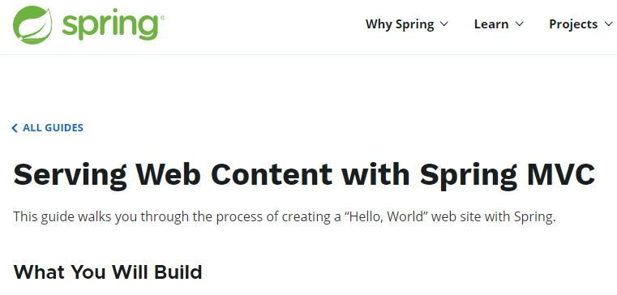

# SpringMVC入门、进阶、源码解析

## 目录

> [springMVC_helloworld.md](notes/springMVC_helloworld.md)，运行起来！
>
> - 从servlet，xml，注解三种方式来编写helloword
> - 引入了springMVC前端控制器的概念
>
> [springMVC_basic.md](notes/springMVC_basic.md)，基础知识
>
> - 详解了前端控制器的运行流程
> - 注解`@RequestMapping`的使用和参数；方法参数的传入传出
> - 深入理解RestFul设计风格
>
> [springMVC_源码.md](notes/springMVC_源码.md) ，源码级别的学习，发现组件的源码都很类似，特别是视图解析、数据绑定、国际化、异常处理
>
> - DispatcherServlet核心代码逻辑
> - SpringMVC的九大组件及其初始化
> - 方法执行源码
> - 视图解析源码
> - 数据绑定源码
>
> [springMVC_功能.md](notes/springMVC_功能.md) ，springMVC工程补充
>
> - 视图解析器，国际化，自定义视图
>
> - 数据校验
>
> - 拦截器及源码解析
>
> [springMVC_notes.md](notes/springMVC_notes.md) ，其他补充
>
> -  tomcat和web.xml配置拦截请求的原理解析

